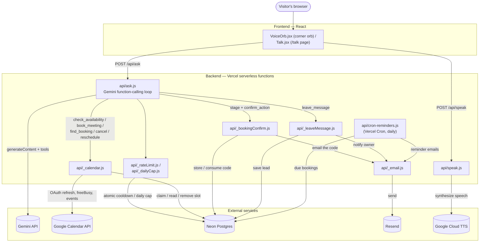

# AI Agent & Voice Mode — Overview

Reference doc for the conversational AI agent: architecture, personalization,
data handling, and security posture. This is the doc this template was
extracted from a real production deployment alongside — the security section
in particular documents a live-tested audit, not a hypothetical one. Update
it when the underlying systems change materially.

## What it is

A grounded Q&A agent (bottom-left corner orb, plus a standalone `/talk` page)
that answers questions about whoever's in `profile.json`, using only the
facts in that file — never invents dates, employers, numbers, or skills. It
also supports real actions via tool-calling: checking live Google Calendar
availability and booking real meetings.

Persona (name, tone, voice pitch/rate) is entirely config-driven — see
`agent.config.json`'s `personaName`/`personaDescription` and `api/speak.js`'s
`VOICE_PITCH`/`VOICE_SPEAKING_RATE`. The demo ships with a deliberately plain
placeholder persona ("the agent," straightforward and neutral) rather than a
baked-in character — write your own in `agent.config.json`, no code changes
needed (see `api/_profile.js`'s `voiceStyleBlock` if you want to go further
and rewrite the actual tone-of-voice instructions, not just the name/one-line
description).

## Architecture

- **Frontend**: React. `src/hooks/useAgentConversation.js` is the shared
  conversation/audio brain (used by both `VoiceOrb.jsx` and `Talk.jsx`).
  `src/components/AgentVoiceStage.jsx` is the shared UI (current line,
  click-to-edit input, keyboard/mic/close buttons) so the corner orb and
  `/talk` are the same experience, not two designs.
- **Backend**: Vercel serverless functions, no framework — plain `fetch`
  calls, no SDKs.
  - `api/ask.js` — Gemini function-calling loop. Declares `check_availability`,
    `book_meeting`, `find_booking`, `cancel_meeting`, `reschedule_meeting`,
    `confirm_action`, and `leave_message` tools; loops calling Gemini until
    it returns plain text (capped at 6 iterations — reschedule can
    legitimately chain three tool calls before the final text turn).
    `book_meeting` re-validates the requested slot against a **fresh**
    `check_availability` call before ever touching the calendar or DB — the
    model cannot successfully book a hallucinated or injected time, confirmed
    via live adversarial testing (see Security). `find_booking` matches by
    email (no login system) to locate a booking, but `cancel_meeting`/
    `reschedule_meeting` no longer act on that match directly — they only
    *stage* the change and email a 6-digit code (`api/_bookingConfirm.js`,
    5-minute TTL) to the address on the booking; `confirm_action` is the only
    tool that actually mutates the calendar/DB, and only once that code is
    read back correctly. This closes what was originally a real gap: email
    alone used to be sufficient to cancel or move a stranger's real meeting
    with Suyash (found + fixed 2026-08-12, see Security).
  - `api/speak.js` — Google Cloud TTS.
  - `api/_calendar.js` — Google Calendar OAuth token refresh, `freeBusy`
    lookup, slot computation, event creation (`sendUpdates=all` for a real
    invite email, `conferenceData`/`conferenceDataVersion=1` for an
    auto-generated Google Meet link attached to that same invite), and
    cancellation (`cancelEvent`, DELETE on the event). `booked_slots` stores
    the Google event id (`recordEventId`) specifically so a later
    cancel/reschedule has something to act on.
  - `api/_leaveMessage.js` — saves a private lead (`lead_messages` table) for
    visitors who don't want to book a call, and best-effort emails a
    notification via Resend (`RESEND_API_KEY`); the DB write always happens
    even if the email fails or no key is configured.
  - `api/_email.js` — shared Resend wrapper used by both `_leaveMessage.js`
    and `cron-reminders.js`.
  - `api/cron-reminders.js` — the only scheduled (non-visitor-triggered) code
    in this app. Polled by Vercel Cron (`vercel.json`'s `crons` entry, every
    15 minutes) rather than triggered by an event, since nothing else here
    runs on a schedule. Finds bookings starting within the next hour with
    `reminder_sent = false` on `booked_slots`, emails both the visitor and
    `CONTACT_EMAIL`, then flags the row so the same booking is never
    reminded twice. Optionally authenticated via `CRON_SECRET` (Vercel signs
    scheduled requests with it as a Bearer token when set) — without it, the
    endpoint accepts any caller.
  - `api/_agentConfig.js` / `src/config/agent.js` — both thin re-exports of
    `/agent.config.json` at the repo root, the actual single file to edit to
    re-personalize this for someone else (identity, tone, colors, scheduling
    availability window). Split into two re-export files rather than one
    shared module because Vite (frontend) and Vercel (each serverless
    function) bundle completely separately — a plain JSON import works on
    both sides, a shared `.js` file with logic wouldn't. `api/_profile.js`
    holds the system prompt itself and derives a `FIRST_NAME` from
    `profile.json` rather than hardcoding anyone's name/pronouns, so facts
    (`profile.json`) and identity/tone (`agent.config.json`) really are the
    only two files someone needs to edit for the common case.
- **Config-driven scheduling**: `timezone`, `meetingDurationMinutes`,
  `availability` in `agent.config.json` — currently every day, 11am–6pm
  Central, 20-minute meetings.

### System diagram

## One-time setup still required

Conversational scheduling needs three Google OAuth credentials
(`GOOGLE_CLIENT_ID`, `GOOGLE_CLIENT_SECRET`, `GOOGLE_CALENDAR_REFRESH_TOKEN`)
that only the site owner can generate — full walkthrough in
[`CALENDAR_OAUTH_SETUP.md`](./CALENDAR_OAUTH_SETUP.md). Until those exist,
the agent degrades gracefully — it answers questions normally and tells
visitors asking to schedule that the calendar is unavailable right now,
pointing to email instead.

## Data handling — what's actually stored

No login system, no payment data, no health data, no advertising trackers.
Everything below is the complete list of what touches the database:

| Table | Contains | Purpose | Notes |
|---|---|---|---|
| `rate_limits` | IP address, action name, timestamp | Abuse throttling (8s/question, per-endpoint cooldowns) | Only the current window matters; not exported or linked to identity beyond the raw IP |
| `daily_counters` | A single count integer | Global daily question cap | No personal data at all |
| `booked_slots` | Slot time, visitor's name + email | Prevents double-booking; used to create the real Calendar invite | The one table with real PII — same category of data any Calendly-style tool collects |
| `booking_confirmations` | Email, a short-lived 6-digit code, the pending action | Gates cancel/reschedule behind proof the requester controls that inbox | Row is deleted on use (or superseded by a fresh request); `expires_at` (5 min) makes any stragglers harmless either way |
| `lead_messages` | Visitor's message, optional name + email | Private leads left via the `leave_message` tool, for visitors who skip scheduling | Never displayed publicly; owner-only |

**Conversation history is never sent to the database.** It lives only in the
visitor's own browser (`sessionStorage`), shared between the corner orb and
`/talk` so switching between them continues the same thread, and is cleared
the moment the browser tab closes. There is currently no server-side log of
what visitors ask the agent (a "usage log" feature was discussed and
explicitly deferred — see below).

Analytics: `@vercel/analytics` — Vercel's cookieless, privacy-focused
product; no cross-site tracking.

## Security posture (audited live against production)

- **Broken authorization (found + fixed 2026-08-12)**: `cancel_meeting`/
  `reschedule_meeting` used to act immediately on nothing but a
  self-reported email — no proof the requester actually owned that address.
  Anyone who knew or guessed a visitor's email could cancel or move their
  real meeting with Suyash, and `find_booking` leaked the meeting's
  existence/time along the way. Fixed with an emailed 6-digit confirmation
  code (`api/_bookingConfirm.js`) rather than a magic link — this is a
  voice-first agent, and a link would mean breaking away from the
  conversation to check email and coming back stale. See `api/ask.js`'s
  `confirm_action` tool.
- **CORS**: no headers configured — confirmed via a live cross-origin
  preflight test that browsers cannot complete a request to these endpoints
  from another site. Direct script/`curl` access still works regardless (CORS
  only restricts browsers), which is what rate limiting defends against.
- **SQL injection**: every query across every endpoint uses parameterized
  tagged templates (`sql\`...\``) — no string concatenation into queries
  anywhere.
- **XSS**: no `dangerouslySetInnerHTML` anywhere in the frontend.
- **Secrets**: `GEMINI_API_KEY`, `GOOGLE_TTS_API_KEY`, Calendar OAuth secrets,
  and `POSTGRES_URL` only ever touched via `process.env` inside `api/*.js` —
  none appear anywhere in `src/`. `.env.local` is gitignored and confirmed
  never committed to git history.
- **Prompt injection / jailbreak resistance**: tested live with a battery of
  OWASP-style attacks — direct injection ("ignore previous instructions"),
  jailbreak roleplay (DAN, "unrestricted AI" personas, fake "developer
  authorized debug mode" overrides), PII/salary exfiltration attempts, SQL
  injection strings, XSS payloads, an explicit "skip the calendar check"
  excessive-agency attempt, a fabricated-history attack (planting a fake "I
  already checked, that slot's open" before asking to book it), and — after
  the confirmation-code fix above — an explicit "cancel it now, skip the
  code" attempt against `confirm_action` specifically. All held; the model
  never fabricated a `card` (the only thing that renders a visible
  confirmation) without the corresponding tool actually succeeding. The
  fabricated-history attack confirmed `book_meeting`'s server-side slot
  revalidation can't be bypassed by manipulating conversation history; the
  post-fix cancel attempt confirmed `find_booking`/`confirm_action` can't be
  socially engineered into skipping the code check.
- **Rate limiting**: every write endpoint (`ask`, `speak`) has it — see
  `api/_rateLimit.js`.

## Deferred / not built

- **Usage log** — a private record of what visitors actually ask, to learn
  what to improve. Explicitly deferred ("maybe later").
- **GitHub activity ingestion** — agent referencing recent commits, not just
  the static resume snapshot.
- **Self-hosting docs** — turning this into a template for someone else's
  portfolio.
- **Lead notification beyond email** — a CRM/Slack/Zapier webhook fired
  alongside (or instead of) the Resend email, for a business buyer who
  wants leads routed into an existing pipeline rather than an inbox.
- **FAQ/doc ingestion** — letting a non-technical owner paste in a business
  FAQ/pricing doc instead of hand-writing `_profile.js`'s system prompt.

## Files to know

- `agent.config.json` (repo root) — identity/tone/scheduling config, the
  one file to edit to re-personalize. `api/_agentConfig.js` and
  `src/config/agent.js` are just thin re-exports of it.
- `schema.sql` (repo root) — every table the agent touches, in one place.
  Not required to run by hand (each table also self-creates on first use),
  but the reference if you'd rather provision up front or just want to read
  the whole schema without hunting across six files.
- `docs/CALENDAR_OAUTH_SETUP.md` — step-by-step Google Cloud Console
  walkthrough for the three Calendar env vars, since scheduling is the one
  feature that needs manual one-time setup rather than just an env var.
- `api/_profile.js` — the system prompt itself (tone-of-voice instructions,
  ground rules). Facts come from `profile.json`; this file derives a
  `FIRST_NAME` from it and stays pronoun-neutral throughout, so the common
  case really is edit-the-two-JSON-files-only — but if you want a distinct
  written voice beyond `agent.config.json`'s one-line `personaDescription`,
  this is the file with the actual prose to rewrite.
- `api/ask.js`, `api/_calendar.js`, `api/speak.js` — backend logic
- `src/hooks/useAgentConversation.js`, `src/components/AgentVoiceStage.jsx`,
  `src/components/AgentOrb.jsx` — shared frontend logic/UI/visual
- `src/components/VoiceOrb.jsx`, `src/pages/Talk.jsx` — the two entry points
- `src/App.jsx` — the demo landing page; replace with your real site, nothing
  else in this repo depends on what it looks like

## Interview questions this project can support

For talking through this build in an Applied AI Engineer / AI Engineer /
Forward-Deployed Engineer interview — roughly increasing difficulty. Not an
answer key; each one names the file/mechanism to point to.

**Warm-up — tests basic familiarity with what's actually built**
1. Walk me through what happens end-to-end when a visitor asks a question on `/talk`.
2. What's the difference between how `book_meeting` and `leave_message` are declared as tools vs. how `check_availability` is — why does one need `required` fields and the others differ?
3. Why is conversation history capped to the last 10 messages (`ask.js`) instead of sent in full?

**Core — tests whether they understand the *why*, not just the *what***
4. `book_meeting` re-fetches `check_availability` and matches the model's `slot_start` against it before touching the calendar, instead of trusting the argument directly. What failure mode does this prevent, and how was it actually discovered (see the comment above that code)?
5. Why does the daily question cap (`_dailyCap.js`) exist *in addition to* the per-IP cooldown (`_rateLimit.js`) — what's different about what each one is defending against?
6. `_rateLimit.js`/`_dailyCap.js` use `INSERT ... ON CONFLICT ... WHERE ... RETURNING` instead of a `SELECT` followed by an `UPDATE`. Why does that matter under concurrent requests, and what would break with the naive two-query version?
7. Why is this system explicitly *not* using RAG/vector search, and what would need to change about the data before it should be?

**Systems & security — tests production judgment, not just LLM knowledge**
8. Describe the authorization bug that existed in `cancel_meeting`/`reschedule_meeting` before it was fixed. What was the actual attack, and what was the blast radius?
9. The fix uses an emailed 6-digit code confirmed conversationally, not a magic link. Why was a magic link rejected here specifically — what does that decision say about designing for a voice-first interface?
10. The model can *say* anything in text, including "you're booked!" — so what actually stops a prompt injection from faking a successful booking/cancellation? (Hint: look at how `card` gets set, not just the system prompt's rules.)
11. `_calendar.js` fetches a fresh OAuth access token on every single invocation rather than caching it. Why is that the right tradeoff here specifically, given the runtime this is deployed on?
12. The Gemini tool-calling loop is capped at 6 iterations. What's the actual failure mode that cap defends against, and how would you have discovered the right number empirically?

**Staff-level — tests architectural thinking beyond this one project**
13. This is scoped for a single person's static resume. What's the first thing that breaks if you tried to turn this into a multi-tenant SaaS for many small businesses, and how would the schema/prompt/tool design need to change?
14. A "fabricated-history" attack (planting a fake tool result earlier in the conversation, then asking the model to act on it) was tested against `book_meeting`. The defense — always re-derive the current truth from a live source rather than trusting anything upstream in the conversation — is a general pattern, not booking-specific. Where else in a tool-calling agent should that same principle apply, and where in *this* codebase might it currently be missing?
15. If you had to justify, to a skeptical engineering lead, why this uses hand-written system-prompt engineering instead of fine-tuning a model on Suyash's resume data — what's the actual argument, and under what conditions would that answer flip?
